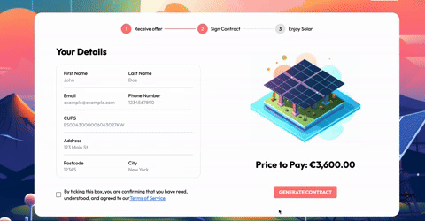

# Neos Online Assessment

## Introduction
In this repo, I tried to recreate the website page in this [Figma File](https://www.figma.com/file/fLbFBhIaFhl6dVf0BCeFdM/Neos-Full-Stack-Engineer---Figma-Test?type=design&node-id=2-106&mode=design&t=cAleaGfg5ZoL5RY7-0). The website page is fully responsive and includes form validation, with the results being logged to the console.


## How to use it

Clone the repo and run the following command:
```
npm i
```
After installing the depencies, you can run the development using:
```
npm run dev
```

Or otherwise, you can build it locally using:
```
npm run build
```
Followed by:
```
npm run preview
```

## How was it built?

#### Technologies Used:
- Vite
- React
- TypeScript
- Tailwind CSS
- PostCSS


Form handling was used with the library React Hook Form.

I also added validation to the form, using Zod before being able to send:



I have also used Shadcn to install some boiler plates that I ended up by modifying to comply with the styling requirements.


